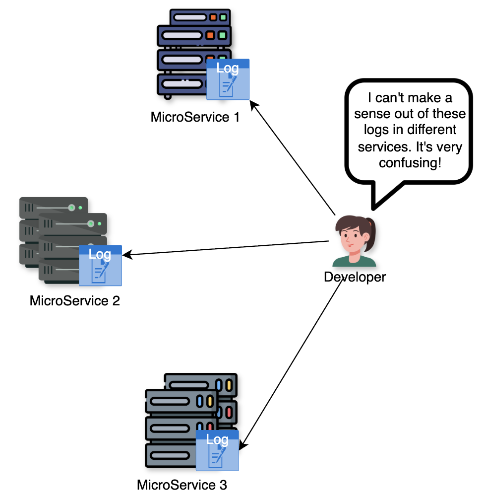
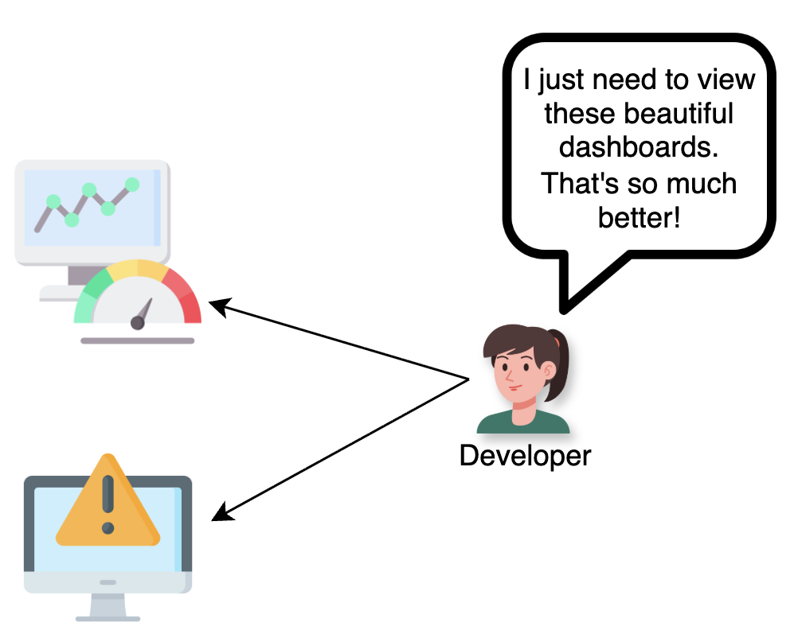
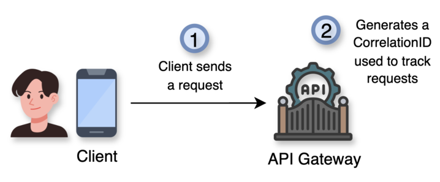
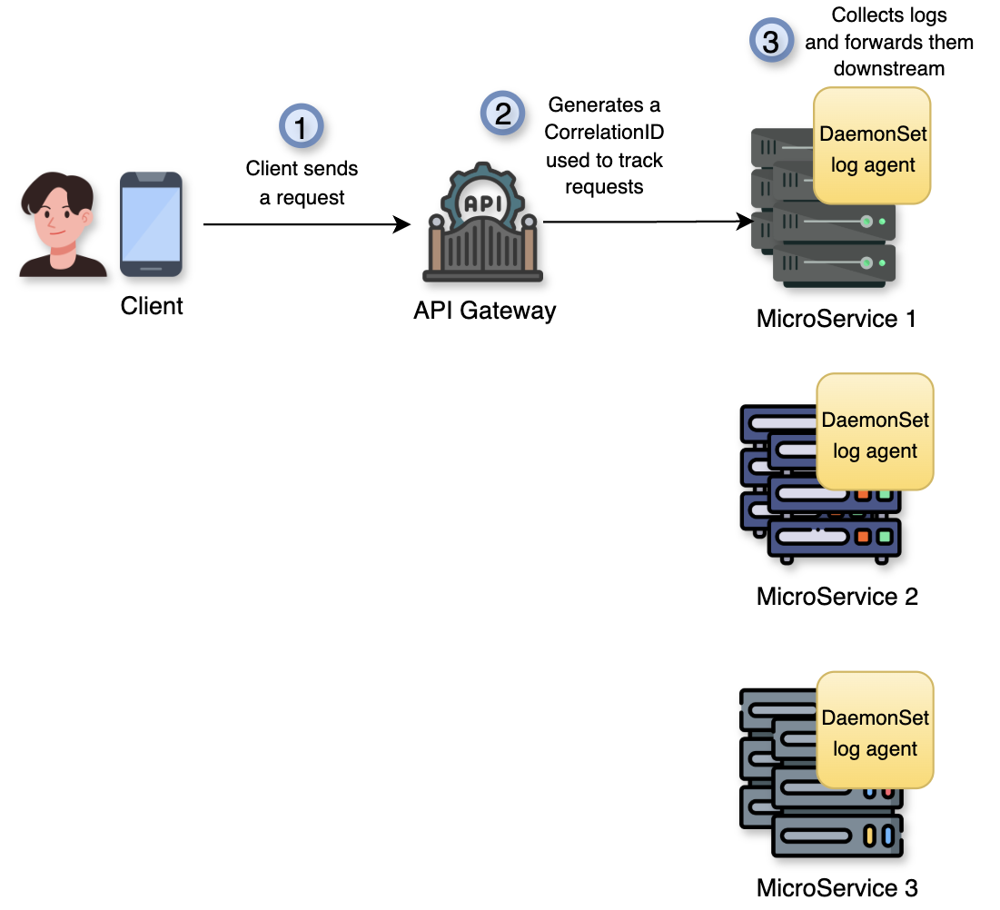
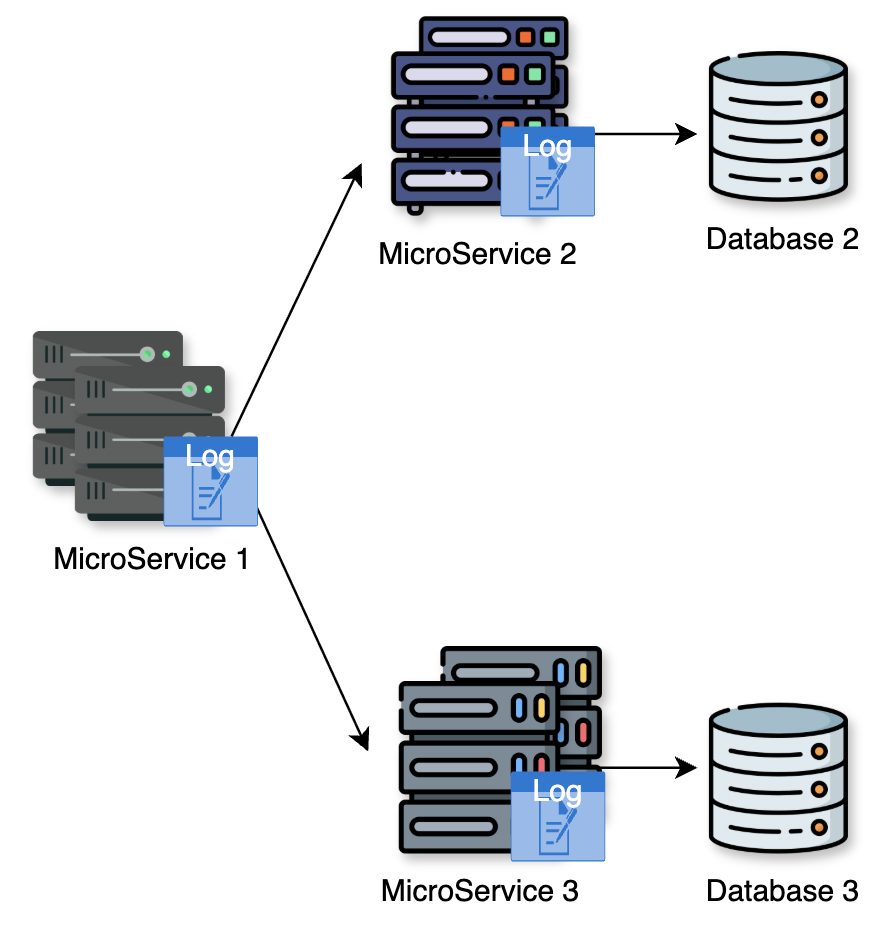
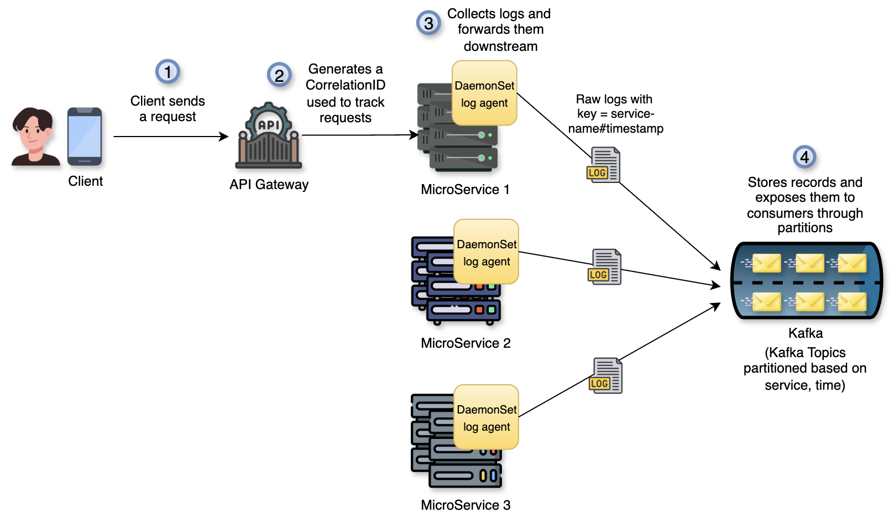
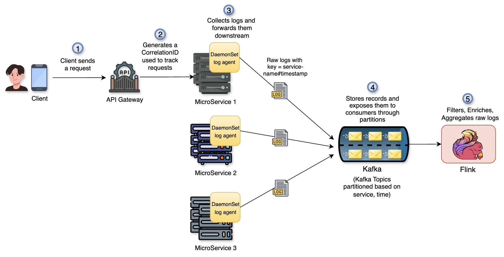
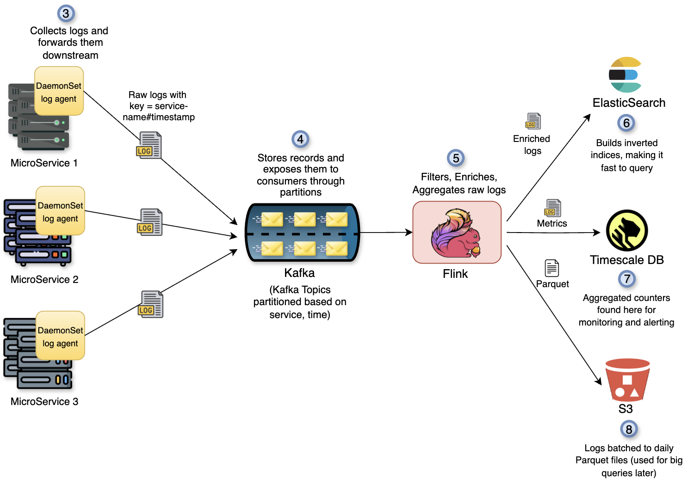
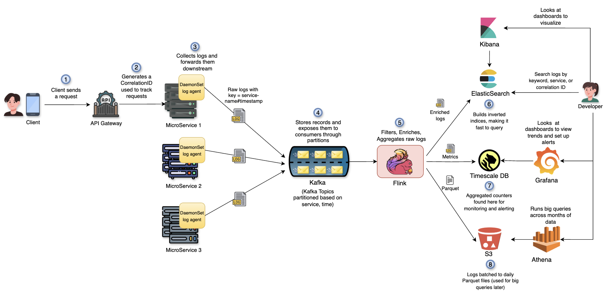

# Distributed Logging System Design

## **Introduction**

Modern software applications often consist of microservices distributed across many servers or containers. Each service generates its own log files, making troubleshooting very challenging when an issue spans multiple services. For example, if a single user request flows through several microservices, the relevant log entries will be scattered across different servers. 

 Without a centralized approach to logging, teams face several difficulties:

* **Slow Debugging:** Engineers must manually access and comb through logs on numerous machines, a time-consuming and error-prone process.
* **Lack of Visibility:** It is hard to get a holistic view of system health and performance without aggregating logs; important patterns or errors might go unnoticed when logs are siloed. 
* **Inconsistent Logging:** Each service might use different log formats or levels, hindering the ability to correlate events end-to-end. Example: Service A logs an error as `{\"error\": \"Timeout\", \"code\": 504}`, while Service B logs the same issue as `504 Gateway Timeout occurred`. When searching, it’s hard to match these two events together since the format and wording are inconsistent.

To address these challenges, we design a **distributed logging system** that **centralizes log data** from all services. This allows for unified monitoring, faster debugging, and the ability to trace events across the entire application. Such a system forms a critical part of observability, complementing metrics and distributed tracing by providing the raw event history needed to diagnose complex issues.

## **System Requirements**

**_Functional Requirements_:**

* **Unified Log Collection:** The system should collect logs from all application services and environments into a central repository, instead of leaving logs isolated on individual hosts.
* **Efficient Search & Retrieval:** Users must be able to query logs quickly (by keywords, timestamps, service, etc.) to pinpoint specific events. The system should support searching across all logs and even tracing an event’s path through multiple services (end-to-end request trace).
* **Distributed Storage:** Log data should be stored reliably in a distributed storage system. The storage solution must handle large volumes of log data and provide redundancy so that logs are durably preserved.
* **Centralized Visualization & Monitoring:** Provide a unified interface (dashboard or UI) where developers can view logs from all services in one place. This includes the ability to set up alerts/notifications when certain log patterns occur (e.g. a high rate of errors) for rapid issue detection.
* **Log Retention**: The system should retain logs. Logs might need to be retained for a certain period (for debugging or compliance) and then purged or archived to comply with regulations and save storage.

**_Non-Functional Requirements_:**

* **Minimally intrusive and low latency:** Logging should not slow down the app. Ingestion is asynchronous so request handling is not blocked.
     _Target latencies_: ingest (agent → Kafka) p95 ≤ 25 ms; search p95 ≤ 100 ms.
* **High Scalability:** The system scales horizontally and handles spikes without data loss.
     _Scale targets_: ingest rate ≈ 300k logs/sec, hot storage ≈ 5 TB/day, search load ≈ 200 QPS.
* **High Availability and Reliability:** The pipeline keeps accepting and storing logs during failures, with no single point of failure and durable storage.
     _Availability target_: end-to-end ≥ 99.9%.
* **Security:** Ensure proper access control and data handling for logs. Logs often contain sensitive information, so the system should restrict access to authorized users and avoid logging sensitive data (like passwords or personal info) in the first place.

## _High Level Design_

## **Client request and correlation ID**

1. A client makes a request to the system.
2. The API Gateway creates a **Correlation ID**. This is a unique tag added to the request so all related logs can be linked. The request then flows to one of the microservices.

**Why Correlation ID?**

* Helps developers trace a single request across multiple services.

## **Collecting logs on each service**

1. Each microservice writes logs (errors, info, debug) to its local files. A **DaemonSet log agent** runs on every service machine (at a node level). It continuously reads new log lines from the services, adds details like service name, time, etc and then forwards them. It also masks sensitive fields like passwords or personal info.

**Technology chosen**

* **Log Agent (Filebeat/Fluent Bit)**: lightweight, efficient, and designed for collecting logs from many machines.

_**Note**_: In the above diagram we never showed relation between these microservices but they might communicate with each other and produce their own logs as shown below.

## **Kafka for buffering**

1. Kafka stores incoming logs safely.
    1. Logs are split into **topics** (like folders) and **partitions** (sub‑divisions) to handle high volume.
    2. Each log record usually contains fields like timestamp, service name, correlation ID, log level, and message. Each new log is appended to the end with an **offset** number. This makes replaying the message and recovery easy.
    3. Consumers (like Flink) read logs at their own pace by keeping track of offsets.

**Technology chosen**

* **Kafka**: a distributed message queue.
    * Provides durability by replicating logs across multiple servers.
    * Decouples producers (log agents) from consumers (Flink, storage).
    * Handles spikes smoothly because logs can wait in partitions until consumed.

## **Processing with Flink**

1. Flink grabs the logs from Kafka and does the following:

    * **Parsing/validation**: If logs are raw text, Flink parses them into structured form. If already JSON/Protobuf, it validates against a schema.
    * **Enrichment**: Add metadata like region, k8s pod labels, build version, etc.
    * **Filtering**: Drop noisy logs (like DEBUG in prod) or sample them (keep 1% of very frequent INFO logs).
    * **Aggregation**: Use windowing (sliding, tumbling, hopping windows) to compute metrics like error rate per minute, average latency, or top N error codes. We will discuss about windowing later.
    * **Routing**: Split the stream into multiple outputs. We will learn about them in detail next.
        * Full, enriched events → `logs.enriched` which are sent to OpenSearch.
        * Aggregated metrics → `logs.metrics` which are sent to TSDB.
        * Batches for archival → hourly Parquet file which are sent to S3.

**Technology chosen**

* **Flink**: a stream processing engine. In simple words, it is a system that reads data as it arrives and processes it in real‑time. Great for transformations, filtering, and aggregations on streams of logs.

## **Storage backends**

1. **ElasticSearch:** Takes enriched logs from Flink and then creates special inverted indices for it. This makes it super fast for searching logs on it. Developers usually search for logs using keyword, service name, or correlation ID. More details about Elastic Search can be found in [Search System Design](../7.%20Design%20Search%20System/Search%20Systems%20Design.md).
2. **TimescaleDB:** It is a database built on top of PostgreSQL but optimized for time-series data (data tracked over time like metrics). This stores metrics data like counts, error rates, or latency numbers which are used for tracking system trends over time and setting up alerts.
3. **S3:** This acts as an archive and also as a data lake for advanced analysis. It stores large volumes of logs for months or years at a very low cost. Logs are written in **Parquet** format daily for efficient storage.

**Technology chosen**

* **Amazon S3**: a reliable object storage service that’s cheap and highly durable.
* **Parquet**: a columnar file format that compresses data well and allows faster queries on big datasets.

## **Query and dashboards**

* **Kibana** (with ElasticSearch):
    * Lets developers search logs and build dashboards.
    * **Why chosen?**: Easy to use UI tightly integrated with ElasticSearch.
* **Grafana** (with TimescaleDB):
    * Shows metrics and trends on dashboards.
    * Can send alerts on error spikes or latency issues.
    * **Why chosen?**: Popular and flexible tool for time‑series visualization.
* **Athena** (with S3):

    * Runs large SQL queries directly on archived logs.
    * **Why chosen?**: No servers needed. Scales easily for ad‑hoc analysis.

With the help of the above, a developer can:

1. **Debug a request**: Search by Correlation ID (or other keywords) in ElasticSearch/Kibana.
2. **Spot errors**: Grafana alerts when error rate goes up in TimescaleDB.
3. **Run reports**: Athena can query across months of Parquet logs in S3 o create reports.

So, that gives us the final design as:

