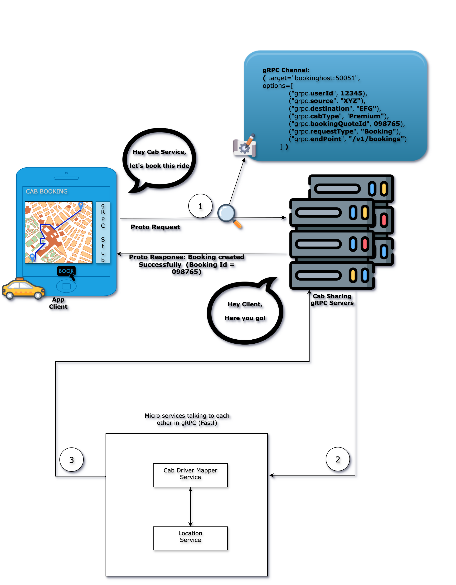

# Cab Sharing API DESIGN via gRPC

[TODO] Update the API design content with gRPC call flow.

We follow a standard way to communicate between the cab sharing systems and also this communication should be quick enough to accommodate the user's booking request. That's why we go with gRPC for this communication.

***Note:*** We can also use REST API for this communication if turn around time between services is negligible 

## API Design :Book a cab

### The process of 'Booking a cab' for a user:
1. **User** sends a booking request with his choice of pick-up and drop-off location(s) to **Cab Sharing Server**.
2. **Cab Sharing Server** maps booking request with a **Cab Driver** who is near to the **user's pick-up location**.
3. **Cab Driver** acknowledges the booking request with his acceptance or rejection.

#### First Part: Sending a booking request to the server.

When we ask the server to book a cab for user's ride, we use an API call. This is how computers talk to each other.

Here are the technical details.

##### gRPC Method
This tells to the server what action to perform. We use gRPC channel(s) to specify the booking request.

##### Endpoint
This tells the server where to perform that action. Since we are booking a ride for a user, we will use the `/v1/bookings` endpoint of the server and this can be sent via gRPC channel.

***Note:*** 'v1' means version 1. It is good practice to version your APIs. You can customize the endpoint based on your convenience.

##### gRPC Channel Body
We have told the server to book a ride for a user, but we haven't provided the details of the booking itself. This information is sent in the gRPC Channel:

```gRPC Channel
(
    target="bookinghost:50051",
    options=[
        ("grpc.userId", 12345),
        ("grpc.source", "XYZ"),
        ("grpc.destination", "EFG"),
        ("grpc.cabType", "Premium"),
        ("grpc.bookingQuoteId", 098765),
        ("grpc.requestType", "Booking"),
        ("grpc.endPoint", "/v1/bookings")
        ]
)
```

***Note:*** This gRPC channel information is a sample one. You can update it as per your convenience.

#### Second Part: Sending a booking request to the Cab Driver.

Lets zoom into the 'communication' for finding a cab driver for our booking.

When we ask the another gRPC client service to find a cab driver for a booking request, we use an API call.

As we follow a standard & efficient way to find a cab driver and will use a gRPC API for this communication. Here are the technical details.

##### gRPC Method
This tells to the server what action to perform. We use gRPC channel(s) to specify the cab driver finding  request.

##### Endpoint
This tells the server where to perform that action. Since we are finding a cab driver, we will use the `/v1/bookings/{bookingReqId}` endpoint of the server and this can be sent via gRPC channel.

#### Third Part: Cab Driver acknowledges the booking request.

What might be the 'communication' for getting acknowledgement from a cab driver?

As we need to send a cab driver acknowledgement, we use an API call to a gRPC server.

Again, we follow a standard & efficient way to send acknowledgement from a cab driver and will use a gRPC API for this communication. Here are the technical details.

##### gRPC Method
This tells to the server what action to perform along with response details. We use gRPC channel(s) to specify the cab driver response.

[TODO] Add more technical details if possible.

***Note:*** Here we may get either booking accept or booking reject from a cab driver.

##### Pictorial representation


## API Design :Track the journey

What might be the 'communication' for journey tracking?

Again, we will use an API call for tracking our journey.

[TBD]

## API Design :Check for the trip history

## API Design :See for the payment history